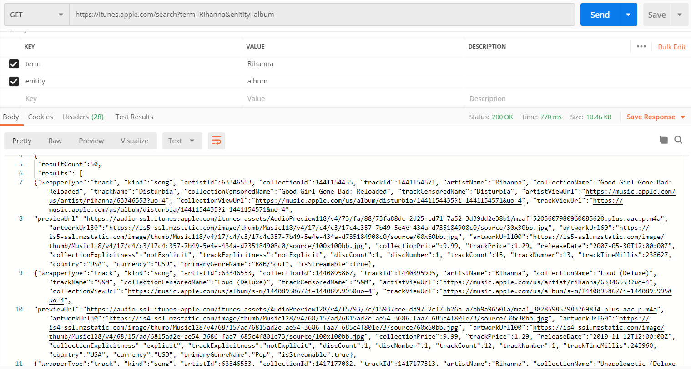
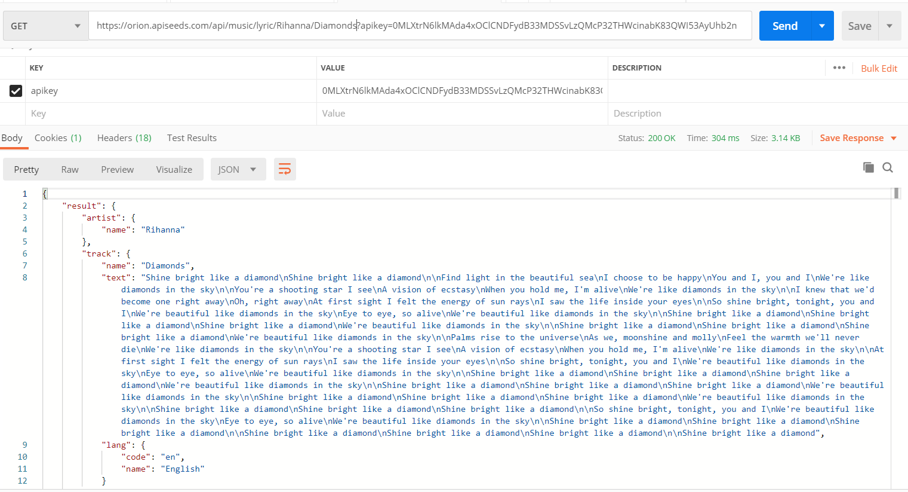
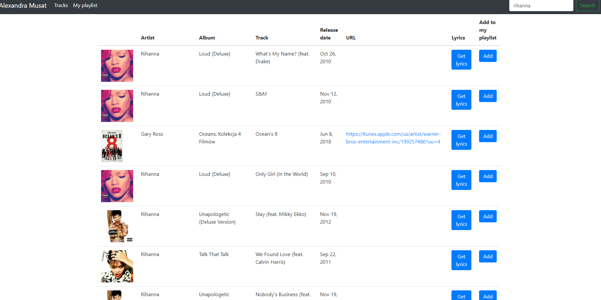
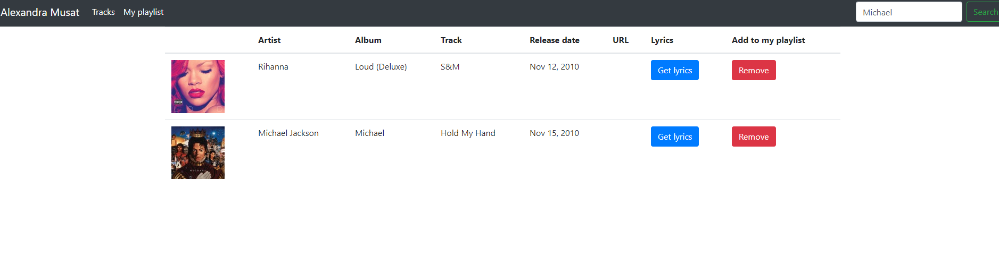
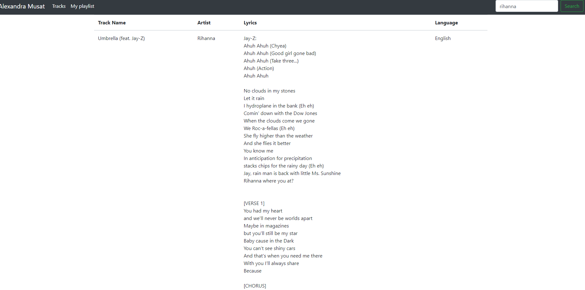
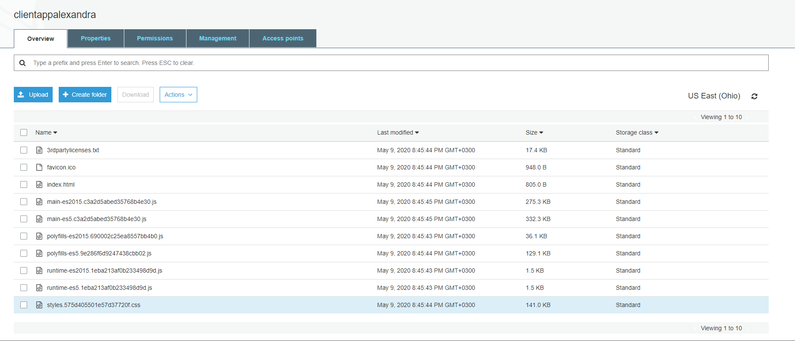

# CloudComputing
Proiect cloud computing 2020- Alexandra Musat

Introducere si descrierea problemei:

In ziua de astăzi realizarea aplicațiilor a devenit din ce in ce mai ușoara datorita integrării acestora cu API-uri deja existente. 
Aplicatia dezvoltata pentru proiect foloseste doua API-uri  si permite utilizatorului sa isi creeze propriul playlist de melodii, tot ce trebuie sa faca este sa caute artistul preferat cu ajutorul obiectului de cautare, iar prin intermediul  butonului de Add/ Remove to playlist artistul impreuna cu melodia preferata sunt adaugate in lista de preferinte muzicale. De asemenea, utilizatorul are posibilitatea, prin intermediul butonului Get lyrics sa vada versurile unei melodi.

Descriere API:

Aplicatia foloseste doua API-uri: 
API-ul Itunes (https://affiliate.itunes.apple.com/resources/documentation/itunes-store-web-service-search-api/ ) este unul public, care nu necesita autentificare si autorizare de servicii, acesta prin intermediul metodei HTTP GET aduce informatii precum: numele artistului, poza, numele melodiei, albumul din care face parte, data lansarii etc. Un exemplu de request care imi intoarce informaii despre artistul: Rihana 

alt exemplu de request:GET https://itunes.apple.com/search?term=Lana del rey&enitity=album

Cel de-al doilea API folosit in cadrul aplicatiei este https://apiseeds.com/documentation/lyrics, acesta este de asemenea un api public, insa spre deosebire de cel anterior necesita un apikey. Prin intermediul metodei HTTP GET aduce in cadrul aplicației versurile melodiei si informatii despre limba in care este cantata melodia.  Un exemplu de request pentru artistul: Rihanna si melodia: Diamonds

alt exemplu de request:GET https://orion.apiseeds.com/api/music/lyric/Florin Salam/Saintropez?apikey=0MLXtrN6lkMAda4xOClCNDFydB33MDSSvLzQMcP32THWcinabK83QWI53AyUhb2n

Flux de date:

Primul flux de date este realizat atunci când aplicația face call-ul prin intermediul URL-ului si al parametrilor către API-ul public. Cel de-al doilea flux îl reprezintă fișierul JSON ce vine ca raspuns, acesta fiind trimis de catre API.

Descriere aplicatie:
Utilizatorul caută in search object-ul din dreapta ecranului numele artistului urmand sa ii apara o lista cu melodiile si albumele acestuia:

Mai departe are posibilitatea de adăugare in lista de preferințe. In cazul in care utilizatorul se răzgândește poate elimina melodia/artistul din lista sau poate adaugă unii noi. 

De asemenea, utilizatorul poate vedea versurile unei melodii prin interactiunea cu butonul get lyrics. Exista si posibilitatea in care actiunea de get lyrics sa nu intoarca nimic in interfata deoarece status code-ul este 404, adica metoda de call pentru versuri nu gaseste niciun rezultat pentru artistul si melodia selectata. 

Aplicatia a fost hostata in cloud utilizand Amazon Simple Storage Service (Amazon S3).

